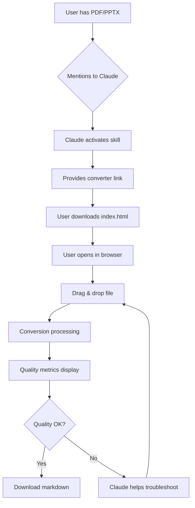

# MarkItDown Converter - Claude Skill Definition

## Skill Metadata

```yaml
name: markitdown-converter
version: 2.1.1
category: document-processing
tags: [pdf, powerpoint, markdown, conversion, links, hyperlinks, structure-detection]
author: Wei-power3
license: MIT
release_date: 2026-02-15
status: production
```

## Skill Purpose

Convert PDF and PowerPoint files to Markdown with:
- 🔗 **Link preservation** from PDF annotations and PPTX hyperlinks
- 📐 **Structure detection** using font analysis and academic keywords
- 🧹 **Text cleaning** to remove artifacts and encoding issues
- 📊 **Quality metrics** for conversion assessment

## When to Use This Skill

Claude should invoke this skill when users:

### Primary Use Cases
1. **Document Conversion**
   - "Convert this PDF to markdown"
   - "Transform my PowerPoint into markdown"
   - "Extract text from this document"

2. **Link Preservation** 🆕
   - "Convert PDF and keep all hyperlinks"
   - "Preserve citations in this paper"
   - "Maintain reference links from presentation"

3. **Structure Analysis**
   - "Convert with proper headers"
   - "Detect sections in this academic paper"
   - "Preserve list formatting"

4. **Batch Processing**
   - "Convert multiple PDFs to markdown"
   - "Process all my slides"
   - "Batch convert research papers"

### Secondary Use Cases
5. **Quality Assessment**
   - "How well did the conversion work?"
   - "Check markdown quality"
   - "Analyze conversion metrics"

6. **Privacy-Focused Conversion**
   - "Convert without uploading"
   - "Process sensitive documents offline"
   - "Client-side only conversion"

## Skill Invocation

### Direct Reference
```
User: @markitdown-converter please convert this PDF
Claude: *activates skill* I'll help you convert that PDF to Markdown...
```

### Contextual Activation
```
User: I need to extract text from a PDF with links preserved
Claude: *recognizes PDF + links context* 
        *activates markitdown-converter skill*
```

### Tool Usage Instruction
```
User: How do I use the MarkItDown converter?
Claude: *provides HOW_TO_USE.md content*
```

## Skill Capabilities

### Phase 2: Link Preservation (v2.1.1)

**What it does:**
```python
def preserve_links(document):
    """
    Extract and preserve hyperlinks from documents.
    
    PDF:
    - Reads PDF.js annotation objects
    - Filters Link subtype annotations
    - Matches links to surrounding text spatially
    - Converts to [text](url) markdown format
    
    PPTX:
    - Parses XML slide structure
    - Reads relationship files (rId → URL)
    - Finds <a:hlinkClick> elements
    - Associates links with text content
    
    Returns:
    - Markdown with preserved hyperlinks
    - Link preservation metrics
    - Link type breakdown (external/internal)
    """
```

**Link Types Supported:**
- External URLs (http://, https://)
- Email links (mailto:)
- FTP links (ftp://)
- Internal PDF links (#page-N)

**Quality Metrics:**
- Links Found: Total hyperlinks detected
- Links Preserved: Successfully converted
- Link Preservation Rate: Percentage retained
- Link Types: External vs. internal breakdown

### Core Features (v2.1.0 + v2.0.0)

**Structure Detection:**
- Font-based header detection (H1/H2/H3)
- Academic section recognition
- Intelligent list detection
- Bold/italic preservation

**Text Cleaning:**
- Ligature fixing (fi, fl, ff)
- Hyphenation repair
- Encoding normalization
- Spacing cleanup

**Quality Scoring:**
- Text Quality: 0-100%
- Structure Score: 0-100%
- Overall Score: Weighted combination
- Issues Fixed: Count of repairs

## Claude Integration Patterns

### Pattern 1: Simple Conversion
```
User: "Convert this research paper to markdown"

Claude Response:
1. *Activates markitdown-converter skill*
2. "I'll convert your research paper to markdown using the MarkItDown
   converter with structure detection and link preservation.
   
   To proceed:
   1. Download the converter: [link to index.html]
   2. Open it in your browser
   3. Drag and drop your PDF
   4. Download the markdown with preserved citations
   
   The converter will:
   - Detect headers and sections automatically
   - Preserve all hyperlinks and citations
   - Clean text artifacts
   - Provide quality metrics"
```

### Pattern 2: Link-Focused Request
```
User: "I need to convert a PDF but keep all the reference links intact"

Claude Response:
1. *Activates markitdown-converter skill (link preservation focus)*
2. "Perfect! The MarkItDown Converter v2.1.1 specializes in preserving
   hyperlinks from PDFs.
   
   Link Preservation Features:
   - ✅ Extracts PDF annotation links
   - ✅ Matches links to surrounding text
   - ✅ Converts to clickable [text](url) format
   - ✅ Tracks preservation rate in metrics
   
   [Provides download link and usage instructions]
   
   After conversion, check the 'Links Preserved' metric to see how
   many references were successfully converted."
```

### Pattern 3: Troubleshooting
```
User: "The converter isn't finding links in my PDF"

Claude Response:
1. *References HOW_TO_USE.md troubleshooting section*
2. "Let's diagnose the link detection issue:
   
   Common causes:
   1. PDF has visual links but no annotation objects
   2. Scanned PDF (image-based, not text)
   3. Links weren't added as hyperlinks in source
   
   To check:
   - Open PDF in reader → Can you click the links?
   - If yes: Links should be detected
   - If no: Links are just text, not hyperlinks
   
   Workaround:
   - [Provides manual linking strategy]"
```

### Pattern 4: Quality Assessment
```
User: "How do I know if the conversion was good?"

Claude Response:
1. *Explains quality metrics dashboard*
2. "The converter provides 4-dimensional quality scoring:
   
   📊 Quality Metrics:
   
   1. Text Quality (0-100%)
      - Measures artifact removal
      - 90-100%: Excellent
      - 70-89%: Good
      - 50-69%: Fair
      - <50%: Poor
   
   2. Structure Score (0-100%)
      - Evaluates markdown richness
      - Headers, lists, formatting
   
   3. Links Preserved (count)
      - Number of hyperlinks converted
      - Purple metric in dashboard
   
   4. Overall Score (0-100%)
      - Weighted combination
      - Best indicator of quality
   
   Recommendation: Aim for Overall Score > 80%"
```

## Skill Limitations

Claude should inform users about:

### Known Limitations
1. **File Size**: Max ~50MB (browser-dependent)
2. **Link Detection**: Only clickable PDF annotations (not plain text URLs)
3. **OCR**: No optical character recognition for scanned PDFs
4. **Tables**: Basic extraction only (Phase 2.2 will improve)
5. **Images**: Not extracted (Phase 4 planned)

### Browser Requirements
- Modern browser (Chrome, Firefox, Safari, Edge)
- JavaScript enabled
- ~100MB available memory per file

### Privacy Assurance
- ✅ 100% client-side processing
- ✅ No server uploads
- ✅ No data transmission
- ✅ Offline capable

## Skill Output

The skill produces:

### Primary Output
- **Markdown file** (.md) with:
  - Preserved hyperlinks in `[text](url)` format
  - Detected headers (H1, H2, H3)
  - Formatted lists (bullets, numbers)
  - Bold/italic text
  - Clean, artifact-free text

### Metadata Output
- **Quality metrics**:
  ```json
  {
    "textQuality": 95,
    "structureScore": 82,
    "linksPreserved": 12,
    "overallScore": 88,
    "issuesFixed": 8,
    "linkPreservationRate": 80
  }
  ```

### Preview Output
- **Browser preview** with:
  - Formatted markdown display
  - Quality metrics header
  - Clickable links
  - Monospace raw markdown

## Version History

### v2.1.1 (Current) - Phase 2: Link Preservation
**New Capabilities:**
- PDF annotation link extraction
- PPTX hyperlink parsing
- Smart link-to-text matching
- Markdown [text](url) formatting
- Link count metrics

**When to mention:**
- User asks about links/hyperlinks
- Converting documents with citations
- Academic papers with references

### v2.1.0 - Phase 1: Structure Enhancement
**Capabilities:**
- Font-based header detection
- Academic section recognition
- List detection and formatting
- Bold/italic preservation

**When to mention:**
- User wants proper structure
- Converting formatted documents
- Research papers with sections

### v2.0.0 - Text Cleaning
**Capabilities:**
- Ligature fixing
- Hyphenation repair
- Encoding normalization

**When to mention:**
- PDF has text artifacts
- Encoding issues present
- Quality concerns

## Skill Workflow

### Typical User Journey



### Claude's Role

1. **Recommendation**: Suggest skill when appropriate
2. **Guidance**: Provide usage instructions
3. **Troubleshooting**: Help resolve issues
4. **Quality Assessment**: Explain metrics
5. **Post-Processing**: Assist with cleanup

## Example Dialogues

### Example 1: Research Paper
```
User: I have a research paper PDF with lots of citations. I need markdown.

Claude: Perfect use case for the MarkItDown Converter! Since your paper
        has citations (hyperlinks), v2.1.1 will preserve them all.
        
        Features that will help:
        - 🔗 Link preservation for citations and references
        - 📚 Academic section detection (Abstract, Methods, Results)
        - 📐 Header detection from font sizes
        - 🧹 Text cleaning for PDF artifacts
        
        [Provides download link and instructions]
        
        After conversion, check the "Links Preserved" metric to confirm
        all citations were captured.
```

### Example 2: Presentation
```
User: Convert my PowerPoint slides to markdown

Claude: I'll help you convert your PowerPoint using the MarkItDown Converter.
        
        For PPTX files, it will:
        - Extract all slide text
        - Preserve hyperlinks you've added
        - Format as bulleted lists
        - Maintain slide structure
        
        [Provides instructions]
        
        Note: Images won't be extracted yet (planned for Phase 4), but
        all text and links will be preserved.
```

### Example 3: Batch Processing
```
User: I have 20 PDFs to convert

Claude: Great! The MarkItDown Converter supports batch processing.
        
        Workflow:
        1. Open the converter once
        2. Drag all 20 PDFs at once
        3. They'll process in parallel
        4. Download each result individually
        
        The stats dashboard will show:
        - Total files: 20
        - Processing: (live count)
        - Completed: (live count)
        - Links Preserved: (cumulative total)
        
        [Provides link and tips for batch processing]
```

## Integration with Other Skills

This skill works well with:

### Complementary Skills
- **claude-md-enhancer**: Further improve markdown quality
- **prompt-factory**: Generate prompts from converted content
- **content-trend-researcher**: Analyze converted documents

### Workflow Chains
```
markitdown-converter → claude-md-enhancer → final document
     (convert)             (polish)           (publish)
```

## Maintenance Notes

### For Skill Developers

**Update triggers:**
- New PDF.js version available
- Link detection improvements
- Additional export formats
- Browser compatibility issues

**Testing checklist:**
- [ ] PDF link extraction
- [ ] PPTX hyperlink parsing
- [ ] Structure detection
- [ ] Text cleaning
- [ ] Quality metrics
- [ ] Browser compatibility

## Support Resources

### User Support
- **HOW_TO_USE.md**: Detailed usage guide
- **README.md**: Feature overview
- **GitHub Issues**: Bug reports and questions

### Developer Support
- **index.html**: Source code (self-contained)
- **PDF.js docs**: https://mozilla.github.io/pdf.js/
- **JSZip docs**: https://stuk.github.io/jszip/

---

## Skill Activation Checklist

Claude should activate this skill when:

- [x] User mentions PDF conversion
- [x] User mentions PowerPoint conversion
- [x] User wants markdown output
- [x] User mentions link preservation
- [x] User asks about document structure
- [x] User needs privacy-focused conversion
- [x] User has multiple files to process
- [x] User asks about conversion quality

**Confidence level**: High when 2+ checkmarks, Medium when 1, Low when 0

---

**Skill Status**: ✅ Production Ready  
**Last Updated**: 2026-02-15  
**Next Update**: Phase 3 planned